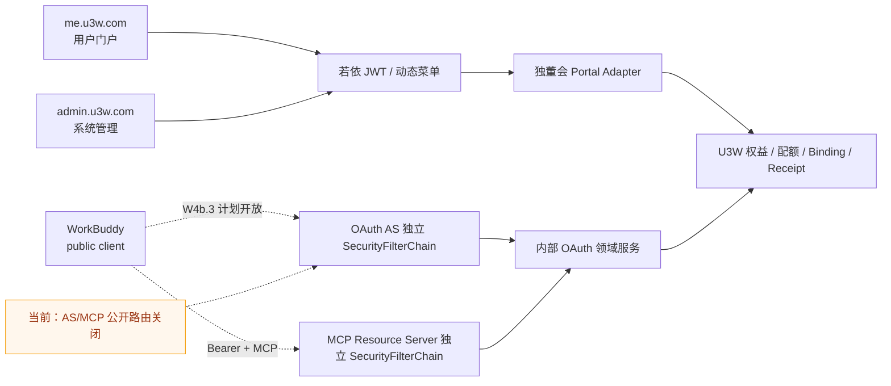
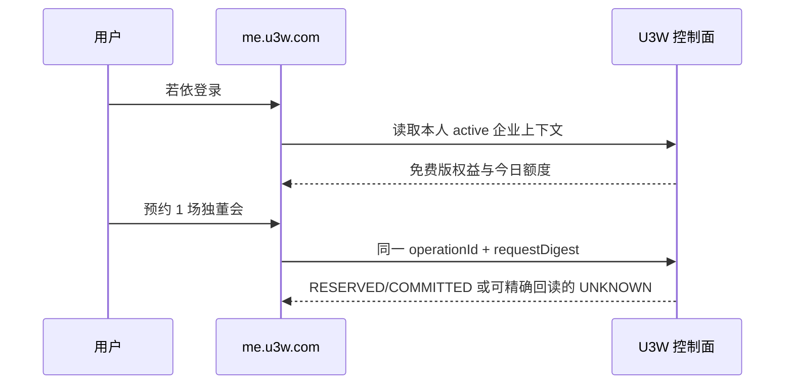
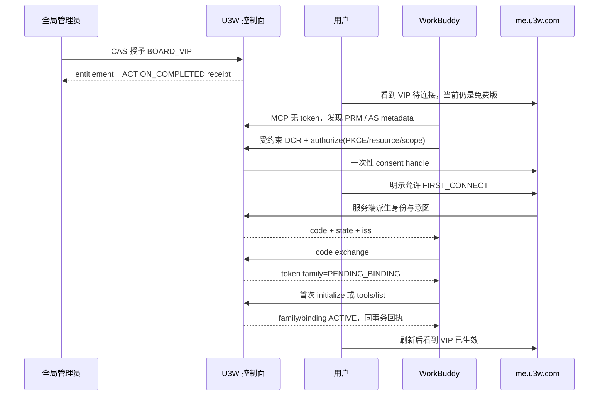

# 福帮手｜独董会 me / admin 详细门户原型设计

> **W4B.2A FRONTEND SOURCE CANDIDATE VERIFIED / DEFAULT OFF / NOT ROUTED**<br>
> 设计版本：`26.7.20-portals-r1`<br>
> 审计日期：`2026-07-21`<br>
> 实施状态：`W4B2A_FRONTEND_SOURCE_CANDIDATE_VERIFIED_LOCAL`<br>
> 确认记录：用户于 `2026-07-21` 以“按建议确认”确认本稿八项决策。<br>
> 中文品牌：**福帮手**；产品名称：**独董会**；英文品牌：**FBSir**。

本文既保留用户确认的门户原型，也记录 W4b.2a 的当前实现边界。`me.u3w.com` 与
`admin.u3w.com` 的六个 OAuth / Connector 页面、共享只读表格、严格安全投影模型和 GET-only
前端 adapter 已形成默认关闭的源码候选；尚无后端 Portal Controller、动态菜单、静态路由或
可访问运行入口。本轮不授权开放公网 OAuth/MCP 接口，不部署、不写生产数据，也不修改已提交
审核的 WorkBuddy 专家包。

当前必须同时保留两个事实：

1. W2/W3 的基础独董会用户页、权益治理、会议审计和权益回执页已存在于仓库；
2. W4b.2a 只证明前端源码候选、纯模型门禁和生产构建；连接/同意/断开写路径、后端读模型、
   菜单/路由、JWT HTTP 安全和公开 OAuth/MCP 路由仍关闭或尚未证明。

---

## 1. 本轮已确认决策

用户已于 `2026-07-21` 以“**按建议确认**”一次确认以下八项。确认只解锁依赖 W4b.1
封板的 W4b.2 候选实施；任何后续调整仍先修改原型，不自动扩大实施或发布权限：

1. **一套若依、两个门户模式**：两个域名复用同一代码库、身份、动态菜单、权限和组件，
   hostname 只决定登录后的默认入口，不承担授权。
2. **品牌锁定**：界面分层显示“福帮手 / FBSir”和产品“独董会”，不再使用任何旧复合
   产品名，也不把品牌和产品写成一个不可拆分的名称。
3. **me 信息架构**：保留现有独董会首页；W4 首增“连接与授权”和只读“安全回执”；积分、
   Webhook、Watch 深页留到后续波次。
4. **同意页透明度**：固定显示“未验证的本地公共客户端”、WorkBuddy 兼容路径、完整
   `127.0.0.1:{port}` 回调地址、四项精确 Scope 和首次连接/显式重授权意图，不自动同意。
5. **断开语义**：断开只终态化 OAuth family / token / Connector binding；VIP 授予本身保留，
   但有效方案立即回退免费版，重新生效必须显式重授权。
6. **admin 先读后写**：OAuth 客户端、token family、Connector binding、安全事件首版以
   只读核验为主；撤销等危险动作必须在事务、回执和并发负向矩阵完成后单独解锁。
7. **管理员边界**：首期继续只支持若依全局 `admin` 角色叠加独董会细粒度权限；企业成员表
   中的 `ADMIN` 不自动获得 `admin.u3w.com` 权限。
8. **波次边界**：W4 只完成 OAuth / Connector；积分能力解锁、用户 Webhook、Apple Watch、
   FBSir Hub 深页、租户委派管理员和真实域名部署均不混入 W4。

---

## 2. 仓库一致性审计

### 2.1 当前事实

| 能力面 | 当前仓库事实 | 本稿结论 |
|---|---|---|
| 若依前端 | Vue 3、Vue Router、Pinia、Element Plus、动态 `getRouters`、`v-hasPermi`、现有 layout/request | 直接复用，禁止另建前端框架 |
| me 基线 | `business/independentBoard/me/index.vue` 已实现企业上下文、权益、额度、预约和最近会议 | 保留，不把它误标为本轮新实现 |
| admin 基线 | 权益治理、会议审计、权益回执三个页面及对应菜单/权限已存在 | 保留，不在本轮改写 |
| me 权限 | 普通 `user` 角色绑定 `my:independent-board:view`；Controller 仍以登录主体和企业成员 current-read 收口 | 新页继续双重校验，菜单权限不能替代服务端范围校验 |
| admin 权限 | 全局 `admin` 角色且同时具备 `board:*` 细粒度权限；当前没有租户委派角色 | W4 不扩权 |
| 权益与额度 | `fbs_product_plan`、`fbs_product_entitlement`、`fbs_usage_budget`、`fbs_usage_operation`、`fbs_entitlement_receipt` | 作为用户首页和 admin 基线真源 |
| Connector | W4a 三张 binding/scope/receipt 表及内部服务存在 | 可供 W4 页面读取，但不能据此宣称公开连接可用 |
| OAuth | 六张 OAuth 表、内部领域服务和候选测试正在演进；仓库没有 OAuth/Connector 页面 API 或公开 Controller | 只作为待完成底座，不得接 UI 或开放路由 |
| 积分 | `sys_user.points`、`wx_points_rule`、`wx_points_record` 和现有积分页存在 | 只复用展示模式；现有写模型不是独董会不可变预占/结算账本 |
| Webhook | 企微 `wc_webhook_url`、secret ref、`wc_webhook_delivery` 和管理页存在 | 复用安全/投递模式；不能直接冒充 VIP 用户自有通用 Webhook 订阅 |
| 主机 | Engine 连接、白名单、黑名单和设备指纹页面存在 | 复用运维组件；不能把 Engine deviceId 当作 Apple Watch ChannelBinding |
| Watch | 当前独董会仅显示 `COMING_SOON`，没有 Watch 权威绑定模型或深页 | W5 规划项 |
| 域名 | inventory 显示 me/admin 已有 DNS/HTTPS 路由但应用仍为 404 | 本地源码不证明线上已部署 |
| 静态原型 | `prototypes/portals/index.html` 是不接 API 的粗粒度示意，包含演示数字且侧栏只切换标题 | 保留为视觉参考，不能作为功能或数据证据 |

本轮只读审计发生在 W4 并行开发中的 dirty worktree；OAuth Java/Mapper/SQL 中可见的新增内容
仍是内部候选。它们只能说明正在开发，不能证明已提交、已构建、已开放或已部署。

### 2.2 必须纠正的旧表述

旧说明把“推荐五项已确认”和“全部门户生产实现”混写。正确分层为：

- **已确认并已存在**：W2/W3 基线页面；
- **已确认且源码候选已实现**：W4b.2a 的 me 两页、admin 四页、GET-only adapter 和安全投影
  模型；三个环境均默认关闭，且没有菜单或路由；
- **尚未实施**：独立窄 JWT Portal Controller、服务端安全投影、候选菜单和写动作；
- **仍禁止**：将候选页面、菜单或 API 作为生产能力开放，以及任何公开协议路由；
- **以后规划**：积分、Webhook、Watch、FBSir Hub、委派管理员和生产域名。

### 2.3 静态原型的使用边界

现有 HTML 可以帮助判断若依式布局、双门户切换和信息密度，但它的 `128 VIP`、`214 场会议`
等均为演示数据；“连接 WorkBuddy”按钮也不连接真实流程。实施时必须：

- 只渲染服务端安全投影；
- 明确 loading / empty / error / unknown / truncated；
- 禁止用示例数、DOM 状态或 HTTP 200 推断权益、连接、投递或业务完成；
- 删除任何可能被误认为线上读数的硬编码运营数字。

---

## 3. 产品体验与系统拓扑

### 3.1 首值与产品层

用户不连接 Connector 也能获得免费版首值：登录后看见当前权益、今日额度并预约一场独董会。
Connector 是 VIP 增强，不是登录、免费首值或普通会议的前置条件。

```text
免费首值：登录 -> 选择企业 -> 看权益/额度 -> 预约独董会
VIP 生效：VIP 授予 -> PENDING_CONNECTOR -> 显式 OAuth -> 首次受保护请求 -> ACTIVE
```

### 3.2 一套应用、三条信任链



- 若依 JWT 不能作为 MCP bearer；
- OAuth bearer 不能登录 me/admin；
- Gitee OAuth token、FBS API Key、授权码兑换码不能跨信任链复用；
- hostname 只在动态路由授权完成后选择默认页面，不能授予权限。

`me.u3w.com` 仅在动态路由已证明用户拥有 `IndependentBoardMe` 后默认进入独董会，否则回退
若依首页；`admin.u3w.com` 保留若依系统首页和全部系统菜单，独董会仍是一级业务模块，不因
域名自动取得 admin 权限。

### 3.3 品牌呈现合同

推荐所有独董会页面使用同一锁定结构：

```text
福帮手  FBSir       <- 品牌层
独董会               <- 产品层
连接与授权 / 权益治理 <- 页面层
```

浏览器标题建议为 `独董会｜福帮手 FBSir`；logo 的 accessible label 为
`福帮手 FBSir`。不得出现任何历史旧名或复合产品名。

---

## 4. 信息架构

### 4.1 me.u3w.com

| 顺序 | 菜单 | 页面责任 | 状态 |
|---|---|---|---|
| 1 | 独董会首页 | 企业上下文、有效计划、今日额度、预约、最近会议、唯一下一步 | `EXISTING_BASELINE` |
| 2 | 会议记录 | 预约/会议状态、议题和产出物入口；首版可继续内嵌首页 | `PLANNED_AFTER_W4` |
| 3 | 连接与授权 | WorkBuddy 连接状态、同意、首次连接、显式重授权、断开、恢复 | `W4_PROTOTYPE_ONLY` |
| 4 | 安全回执 | 本人的授权、binding、撤销和安全事件安全投影 | `W4_PROTOTYPE_ONLY` |
| 5 | 能力与积分 | 免费/VIP 能力、积分余额、不可变产品流水、解锁说明 | `W5_PROTOTYPE_ONLY` |
| 6 | 推送订阅 | 用户 Webhook、会议进展、独董会内参、投递回执 | `W5_PROTOTYPE_ONLY` |
| 7 | 设备与云资产 | Apple Watch、ChannelBinding、FBSir Hub、批准/撤销 | `W5_PROTOTYPE_ONLY` |

W4 实施时只增加第 3、4 项；第 5—7 项只在首页保留“后续能力”状态，不提供伪按钮。

### 4.2 admin.u3w.com

| 顺序 | 菜单 | 页面责任 | 状态 |
|---|---|---|---|
| 1 | 独董会运营总览 | 权益、连接、异常和回执的可下钻聚合；不得使用假指标 | `PLANNED_AFTER_W4` |
| 2 | 权益治理 | 免费/VIP 授予、调整、撤销及 Connector 待生效提示 | `EXISTING_BASELINE` |
| 3 | 权益回执 | 授予/调整/撤销的只读回执 | `EXISTING_BASELINE` |
| 4 | 会议审计 | 配额预约操作审计，不冒充会议完成 | `EXISTING_BASELINE` |
| 5 | OAuth 客户端 | DCR 客户端、固定 profile、状态和期限 | `W4_PROTOTYPE_ONLY` |
| 6 | Token Family | family、generation、binding、终态和并发/重放风险 | `W4_PROTOTYPE_ONLY` |
| 7 | Connector Binding | 绑定、Scope、验证方法、版本、最后访问和撤销 | `W4_PROTOTYPE_ONLY` |
| 8 | OAuth 安全事件 | 授权/激活/重授权/轮换/撤销/重放回执和 correlation | `W4_PROTOTYPE_ONLY` |
| 9 | 积分与账本 | 产品规则、预占、结算、释放、退款及对账 | `W5_PROTOTYPE_ONLY` |
| 10 | Webhook 与投递 | endpoint、订阅、Outbox、UNKNOWN 和回读 | `W5_PROTOTYPE_ONLY` |
| 11 | 设备与主机 | Watch、ChannelBinding、Hub 状态、隔离和吊销 | `W5_PROTOTYPE_ONLY` |
| 12 | 域名与发布 | commit/build/migration/readback/rollback 证据 | `W6_INTERNAL_ONLY` |

W4 不重排若依现有系统菜单；新增项继续挂在既有“独董会管理”一级目录下。

---

## 5. 角色、权限与数据范围

### 5.1 当前角色事实

| 主体 | 当前凭证/关系 | 能做什么 | 不能做什么 |
|---|---|---|---|
| 普通用户 | 若依登录 + `user` 角色 + active `fbs_enterprise_member` | 查看本人企业上下文、权益、额度并预约 | 查看其他成员、管理 OAuth 客户端或授予权益 |
| 企业成员 `ADMIN` | `fbs_enterprise_member.role=ADMIN` | 当前只是一条企业关系属性 | 不能据此进入系统管理后台 |
| 全局系统管理员 | 若依 `admin` + 对应 `board:*` 权限 | 既有权益治理和审计 | 不能替用户同意 OAuth、不能伪造业务回执 |
| OAuth public client | DCR client id + PKCE + 固定 profile | 按协议申请授权和调用精确 MCP Scope | 登录 me/admin、证明自己一定是 WorkBuddy |
| MCP bearer | opaque access token + ACTIVE family/binding | 调用授权 Scope 内的 MCP | 调用普通若依 API 或扩大 Scope |

### 5.2 W4 拟议权限

以下只是命名与分权原型，不在本轮创建 `sys_menu` 或 `sys_role_menu`：

| 页面/动作 | 拟议权限 | 服务端强制条件 |
|---|---|---|
| me 查看连接 | `my:independent-board:connector:view` | 登录主体 + active 企业成员 + 精确本人 current-read |
| me 发起首次连接/重授权 | `my:independent-board:connector:authorize` | VIP 授予、服务端推导 consent intent、固定 profile |
| me 断开 | `my:independent-board:connector:revoke` | 本人精确 binding/family、幂等键、expected version、事务回执 |
| me 查看安全回执 | `my:independent-board:security:view` | 只返回本人/当前企业允许字段 |
| admin 客户端只读 | `board:oauth:client:query` | `admin` 角色叠加权限、分页、字段 allowlist |
| admin family 只读 | `board:oauth:family:query` | 同上，禁止返回 token/code 原值 |
| admin binding 只读 | `board:connector:query` | 同上，精确租户筛选 |
| admin 安全事件 | `board:oauth:security:audit` | 同上，只读、分页、可证明截断 |
| admin 撤销 family | `board:oauth:family:revoke` | 单独解锁；原因码、expected version、事务、回执、current-read |
| admin 撤销 binding | `board:connector:revoke` | 单独解锁；不能伪造用户批准或直接恢复 |

菜单权限只控制可见性和按钮；Controller/Service 必须重新验证主体、租户、成员、状态、版本和
对象拓扑。W4 不创建租户委派管理员，不把 `fbs_enterprise_member.role` 映射成若依 `admin`。

---

## 6. me 页面详细原型

### 6.1 独董会首页（既有基线的 W4 接入点）

保留当前“权益—额度—会议”首值结构。W4 只改变 Connector 状态卡和 CTA 的去向：

| 聚合状态 | 首页文案 | 主动作 | 禁止表达 |
|---|---|---|---|
| 免费版 | 免费版；1 次/日、5 议题、3 席位 | 预约独董会 | “必须连接后使用” |
| VIP 已授予、未连接 | VIP 待连接；当前仍按免费版 | 连接 WorkBuddy | “VIP 已生效” |
| 授权已完成、待首次受保护请求 | 已授权，等待 WorkBuddy 完成安全激活 | 返回 WorkBuddy / 刷新状态 | “连接成功” |
| VIP 已生效 | VIP 版；5 次/日、30 议题、全员与秘书 | 预约 VIP 独董会 | 只凭 token 兑换显示生效 |
| 需重新授权 | 连接已失效；当前按免费版 | 显式重新授权 | 自动恢复旧 binding |
| 状态未知 | 暂时无法核验，按安全模式显示 | 刷新 / 查看帮助 | 猜测 ACTIVE |

首页仍不得把预约操作写成会议已经完成；最近会议应延续当前 `fbs_usage_operation` 的真实状态。

### 6.2 连接与授权

推荐布局：

```text
福帮手 FBSir
独董会 / 连接与授权

[有效方案] [WorkBuddy 连接状态] [有效至]

当前连接
  未验证的本地公共客户端
  Marketplace entry: fbs-connector
  Resource: https://api2.u3w.com/fbs-mcp/mcp
  Scope: 4 项
  状态 / 最近访问 / 到期 / 版本

[主动作：连接 / 重新授权 / 返回 WorkBuddy]
[次动作：查看权限] [危险动作：断开连接]
```

页面使用一个**服务端聚合状态**，不把单张表状态直接暴露为业务结论：

| UI 状态 | 最低真源条件 | 允许动作 |
|---|---|---|
| `NOT_CONNECTED` | 无可用 ACTIVE binding/family；读取完整且无漂移 | 首次连接 |
| `AUTHORIZATION_PENDING`（仅原型、W4b.2a 未实现） | 服务端绑定本人且未过期的 request handle | 后续合同闭合后才允许继续、取消、刷新 |
| `PENDING_ACTIVATION` | code 已兑换，family=`PENDING_BINDING`，binding 未 ACTIVE | 返回 WorkBuddy、刷新 |
| `ACTIVE` | entitlement/plan、family、tokens、binding、四 Scope 和版本 current-read 全部一致 | 查看详情、显式重授权、断开 |
| `REAUTH_REQUIRED` | binding/family 已 REVOKED/COMPROMISED/EXPIRED 或 client 失效 | 显式重授权 |
| `UNKNOWN` | current-read 失败、截断、重复或拓扑漂移 | 只刷新/求助，危险动作关闭 |

`AUTHORIZATION_PENDING` 是保留的原型聚合名：W4b.2a 因没有服务端绑定到当前登录主体的 request
handle，未把它加入前端候选状态 allowlist，也不得从浏览器本地状态推断。`PENDING_ACTIVATION` 是
当前候选已实现的 UI 聚合名；两者均不新增同名数据库状态。

### 6.3 OAuth 同意页

固定地址由 W4b 合同规划为 `https://me.u3w.com/oauth/consent`。页面必须使用若依登录态，但
不得在全局若依链中放开 OAuth bearer。它是隐藏的一次性路由，不出现在侧栏菜单；无有效
request handle 的直接访问只显示本地错误页。

```text
福帮手 FBSir
允许 WorkBuddy 兼容连接访问独董会？

客户端：未验证的本地公共客户端
说明：你选择了 WorkBuddy 兼容连接路径；这不是宿主身份认证。
回调：http://127.0.0.1:54321/oauth/callback   <- 完整展示
企业：由登录主体和服务端上下文确认
意图：首次连接 / 显式重新授权

将允许：
✓ 读取身份绑定信息             identity.read
✓ 读取独董会权益               entitlement.read
✓ 预约独董会会议               board.meeting.reserve
✓ 写入受控操作回执             board.receipt.write

[拒绝] [允许并返回 WorkBuddy]
```

关键状态：

- 未登录：回到若依登录，安全保留一次性 request handle，登录后再次 current-read；
- handle 无效/过期/已消费：本地错误页停止，不跳转到未验证 redirect；
- 企业/成员/VIP 状态漂移：拒绝且零授权写入；
- `FIRST_CONNECT`：仅接受 `PENDING_CONNECTOR` 且不存在 authoritative ACTIVE binding；
- `EXPLICIT_REAUTHORIZATION`：只能从具名“重新授权”动作进入，不能由表状态临时猜测；
- approve/deny 提交中：按钮锁定，重复提交返回同一安全终态或稳定冲突；
- 网络未知：先按 request handle 精确回读，不能新建第二个授权事务；
- approved：只在 redirect 已被精确验证后返回 code、state、iss；
- denied：写拒绝终态并按协议安全返回，不展示内部主键。

浏览器只能提交 request handle 和显式 approve/deny；tenant/member/user、client、redirect、
resource、scope 和 consent intent 全部由服务端推导。

### 6.4 断开与显式重授权

断开确认框必须说明：

- 已授予 VIP 不被删除；
- 当前 Connector binding、family 和活跃 token 将被终态化；
- 独董会立即按免费版额度运行；
- 恢复必须重新完成显式授权和首次受保护请求；
- 本动作不可用“撤销后恢复原 token”撤回。

提交必须带服务端生成的幂等键与 expected version；若响应未知，保留原动作并精确回读。页面
不得因按钮成功动画先行显示“已断开”。

显式重授权必须展示旧连接状态和“将替换当前授权代次”，成功后 binding version 增一、旧
ACTIVE family 终态化；它不是 refresh rotation。

### 6.5 安全回执

首版只展示安全投影：时间、动作、结果层级、客户端缩略标识、binding/family 缩略标识、
correlation id、是否由用户/客户端/系统触发。禁止返回：

- raw authorization code、access token、refresh token、PKCE verifier、state；
- Cookie、Authorization header、state 密钥引用或密文；
- 完整主体摘要、原始 IP、内部异常栈；
- 把 `ACTION_COMPLETED` 写成 `DELIVERED` 或 `BUSINESS_CONFIRMED`。

---

## 7. admin 页面详细原型

### 7.1 OAuth 客户端

默认只读列表字段：客户端缩略 ID、中性名称、状态、loopback 端口/完整 redirect、固定 grant、
四项 Scope、注册时间、到期时间、终止时间、版本。详情显示 metadata digest 与 registration
source digest 的缩略值，但不把 `source_code=WORKBUDDY` 描述为宿主已认证。

筛选：状态、注册时间、到期窗口、redirect 端口、客户端缩略 ID。首版不提供编辑 metadata、
延长有效期或配置 client secret；public client 本来就不签发 secret。

### 7.2 Token Family

列表字段：family 缩略 ID、企业/成员/用户安全标签、client 缩略 ID、consent intent、状态、
当前 refresh generation、binding 缩略 ID、签发/激活/到期/终止时间、版本。

状态必须原样区分：

```text
PENDING_BINDING -> ACTIVE -> REVOKED | COMPROMISED | EXPIRED
```

- `PENDING_BINDING` 不计为 VIP 生效；
- `COMPROMISED` 显示红色安全事件，不展示被重放 token；
- 并发 refresh 的失败方可能触发整族 compromise，页面必须展示最终 current-read，而不是
  “一方刷新成功” toast；
- 撤销按钮在事务/回执/并发门禁完成前不可出现。

### 7.3 Connector Binding

字段：binding 缩略 ID、企业/成员/用户、产品、source、connector、状态、四项 Scope、
verification method、verified/last seen/valid until/revoked at、client、subject 摘要缩略值、版本。

业务标签必须由完整拓扑推导：

- `ACTIVE + exact scopes + active family + active entitlement` 才显示“VIP 连接已生效”；
- `REVOKED/COMPROMISED` 不能显示“离线”这种可自动恢复文案；
- entitlement 已降级时，即使旧 binding 行仍可读，也显示“历史连接，不生效”；
- admin 不能把 terminal binding 直接改回 ACTIVE，只能让用户显式重授权。

### 7.4 OAuth 安全事件

事件页以 immutable receipt 为主轴，提供时间、action、actor type、企业/成员、client/family/
binding 缩略 lineage、correlation、evidence level 和固定 reason code。建议视图：

- 授权：request approved/denied、code issued/consumed；
- family：created/activated/reauthorized/rotated/revoked/compromised；
- binding：verified/revoked/compromised；
- 风险：code replay、refresh replay、scope/resource mismatch、current-read drift。

若某类 action 或 actor 还没有精确 schema、不可变回执和 current-read，UI 必须显示
“该事件模型尚未实现”，不能从普通日志拼装成功回执。

### 7.5 危险动作模式

admin 撤销 family/binding 的未来原型统一使用：

1. 先展示当前版本和影响范围；
2. 选择固定 reason code，备注只进入受控审计，不进入协议错误响应；
3. 二次确认，不支持批量默认全选；
4. 以 operation/idempotency key + expected version 提交；
5. 响应后 current-read family、token、binding、entitlement 和 receipt；
6. 未知结果进入“待核验”，不自动重试；
7. 管理员不能代替用户 approve consent，也不能一键恢复 terminal binding。

---

## 8. 端到端用户旅程

### 8.1 免费版首值



Connector 未打开不阻断本旅程。

### 8.2 管理员授予 VIP 后首次连接



此图是目标旅程，不表示公开端点已经存在。

### 8.3 重放安全事件

```text
已使用 refresh token 再次出现
  -> 锁定完整 family/token/binding
  -> family COMPROMISED
  -> 所有活跃 token REVOKED
  -> binding COMPROMISED
  -> 写安全回执并提交
  -> 对协议调用返回 invalid_grant
  -> me 显示“需重新授权”，admin 显示安全事件
```

不能先抛异常导致安全终态回滚，也不能把第二个并发刷新只显示成普通失败。

### 8.4 用户断开

```text
ACTIVE -> 用户查看影响 -> 确认断开 -> 原子终态化并写回执
       -> current-read -> effective plan 回退 BOARD_FREE
       -> 若需恢复，显式 EXPLICIT_REAUTHORIZATION
```

### 8.5 后续旅程（不在 W4 实施）

- 积分：查看余额 -> 选择能力 -> 服务端计算成本 -> 预占 -> 完成结算 / 失败释放 -> 不可变流水；
- Webhook：验证 endpoint -> 选择会议进展/独董会内参 -> Outbox -> provider result -> 回读；
- Watch：VIP 身份 -> ChannelBinding -> 接收 ApprovalChallenge -> 批准/拒绝/取消 -> Receipt。

---

## 9. API 与表依赖映射（仅规划）

### 9.1 已有 API 保留

| API | 当前用途 | W4 处理 |
|---|---|---|
| `GET /my/independent-board/contexts` | 本人企业上下文 | 保留 |
| `GET /my/independent-board/dashboard` | 权益、额度、最近预约和粗粒度 Connector 状态 | 保留；不当详细连接真源 |
| `GET /my/independent-board/meeting-reservations/{operationId}` | 未知结果精确回读 | 保留 |
| `POST /my/independent-board/meeting-reservations` | 幂等预约 | 保留 |
| `/business/independent-board/entitlements*` | admin 权益授予/查询/撤销 | 保留 |
| `/business/independent-board/entitlement-receipts` | admin 权益回执 | 保留 |
| `/business/independent-board/operations` | admin 配额操作审计 | 保留 |

本稿不向现有 `IndependentBoardMeController` 或 `IndependentBoardAdminController` 添加方法；
未来 W4 采用独立窄 Controller/adapter，避免把 JWT 门户、OAuth 协议和 MCP 信任边界混在一起。

### 9.2 W4 门户 API 草案

以下路径用于已确认原型的候选命名和契约。六个 GET 路径已有默认关闭的前端 wrapper，但服务端
Controller 尚不存在；所有 POST 路径仍未实现。任何源码 wrapper 都不得被当成公网能力：

| 拟议 API | 调用方 | 输入边界 | 依赖 |
|---|---|---|---|
| `GET /my/independent-board/connector` | me JWT | 显式企业上下文；身份由服务端 | entitlement、binding/scope、client/family/token 安全投影 |
| `POST /my/independent-board/connector/reauthorization-intents` | me JWT | 具名重新授权动作、幂等键；不能提交 scope/resource/identity | 生成短期 server-side reauthorization intent；与 WorkBuddy 的交接由 W4c 验证 |
| `POST /my/independent-board/oauth/consent/context` | me JWT | body 中的单次 handle + server-issued context ref；不放 URL | request + client + active enterprise/member + VIP current-read |
| `POST /my/independent-board/oauth/consent/approve` | me JWT | body 仅含 handle、context ref 与防重字段 | 内部 approve transaction |
| `POST /my/independent-board/oauth/consent/deny` | me JWT | body 仅含 handle、context ref 与防重字段 | 内部 deny transaction |
| `POST /my/independent-board/connector/revoke` | me JWT | 幂等键、expected version；身份/对象服务端派生 | family/token/binding/receipt 事务 |
| `GET /my/independent-board/security-receipts` | me JWT | 当前企业、分页游标 | binding/oauth receipt 安全投影 |
| `GET /business/independent-board/oauth/clients` | admin JWT | 筛选、分页 | `fbs_oauth_client` |
| `GET /business/independent-board/oauth/families` | admin JWT | 租户、状态、分页 | family + binding + client 安全投影 |
| `GET /business/independent-board/connector-bindings` | admin JWT | 租户、状态、分页 | binding/scope/entitlement |
| `GET /business/independent-board/oauth/security-events` | admin JWT | 租户、action、时间、分页 | OAuth/Connector immutable receipts |
| `POST /business/independent-board/oauth/families/{familyId}/revoke` | admin JWT | reason code、幂等键、expected version | 危险动作单独解锁 |
| `POST /business/independent-board/connector-bindings/{bindingId}/revoke` | admin JWT | reason code、幂等键、expected version | 危险动作单独解锁 |

所有列表必须有服务端上限、稳定排序、游标/分页和显式 `truncated`；任何拓扑重复、字段缺失或
unexpected enum 都 fail closed，前端不自行“修复”。

首次授权请求仍由 WorkBuddy 按标准 `/oauth2/authorize` 流程发起，不由 me 页面伪造
client/redirect/PKCE/state/resource/scope。若 WorkBuddy 没有经验证的 deep link，me 的“连接”
主动作只能展示准确步骤或返回宿主，不得发明私有 URL scheme。原始 request handle 只通过
`no-store` 的受控浏览器交接和 POST body 使用，禁止放入日志、埋点或普通历史记录。

### 9.3 W4 协议端点（合同已锁，当前关闭）

| 端点 | 固定值 | 当前状态 |
|---|---|---|
| PRM | `https://api2.u3w.com/.well-known/oauth-protected-resource/fbs-mcp/mcp` | `NOT IMPLEMENTED / CLOSED` |
| AS metadata | `https://api2.u3w.com/.well-known/oauth-authorization-server` | `NOT IMPLEMENTED / CLOSED` |
| DCR | `https://api2.u3w.com/oauth2/register` | `NOT IMPLEMENTED / CLOSED` |
| authorize | `https://api2.u3w.com/oauth2/authorize` | `NOT IMPLEMENTED / CLOSED` |
| token | `https://api2.u3w.com/oauth2/token` | `NOT IMPLEMENTED / CLOSED` |
| revoke | `https://api2.u3w.com/oauth2/revoke` | `NOT IMPLEMENTED / CLOSED` |
| MCP | `https://api2.u3w.com/fbs-mcp/mcp` | W4b 受保护形态未开放 |

AS metadata 只能发布已真实实现并通过负向矩阵的端点，不能用文档或内部服务提前占位。

### 9.4 表与页面映射

| 页面能力 | 当前表 | 复用/新增判断 |
|---|---|---|
| 身份、角色、菜单 | `sys_user`、`sys_role`、`sys_menu`、`sys_role_menu` | 复用若依；新增菜单须单独迁移和碰撞审计 |
| 企业上下文 | `fbs_enterprise`、`fbs_enterprise_member` | 复用；企业 `ADMIN` 不等于系统 admin |
| 计划/权益 | `fbs_product_plan`、`fbs_product_entitlement` | 复用 |
| 会议额度/预约 | `fbs_usage_budget`、`fbs_usage_operation` | 复用；预约不等于会议完成 |
| 权益回执 | `fbs_entitlement_receipt` | 复用既有页面；不跨级推断 |
| Connector 详情 | `fbs_connector_binding`、`fbs_connector_binding_scope`、`fbs_connector_binding_receipt` | 复用；安全事件 action/actor schema 必须先完整 |
| OAuth 客户端/授权/token | `fbs_oauth_client`、`fbs_oauth_authorization_request`、`fbs_oauth_authorization_code`、`fbs_oauth_token_family`、`fbs_oauth_token`、`fbs_oauth_receipt` | 复用内部底座；raw secret 永不进入页面 |
| 积分展示 | `sys_user.points`、`wx_points_rule`、`wx_points_record` | 只复用只读展示；写模型另审 |
| 独董会积分预占/结算 | 当前无满足要求的不可变状态账本 | 建议未来新增产品 scoped operation/ledger，不修改 W4 |
| 企微 Webhook | `wc_webhook_url`、`wc_webhook_delivery` | 复用 endpoint 安全与投递回执模式 |
| VIP 自有通用 Webhook 订阅 | 当前无产品/成员/topic 订阅模型 | W5 新增 endpoint/subscription/outbox 合同；不得直接套企微 URL 表 |
| Apple Watch / ChannelBinding | 当前无独董会权威模型 | W5 新增 device/channel binding 与 ApprovalChallenge 合同 |
| FBSir Hub | 现有 Engine 连接/白黑名单为相邻能力 | 只复用运维组件；需独立 Host identity/capability/lease 合同 |

### 9.5 积分现状的明确限制

现有积分余额存于 `sys_user.points`，`wx_points_record` 支持普通增减和 `event_id` 幂等；现有
接口仍允许调用路径传 `changeAmount`，服务注释也明确“**不做冻结预占**”，Mapper 还存在更新/
删除记录能力。因此在新增独董会产品账本前：

- me 只能只读展示余额和历史；
- 不能让浏览器提交扣减金额；
- 不能宣称已有 Grant/Reserve/Settle/Release/Refund 不可变账本；
- 不能把积分写成现金、充值余额或法币价值；
- 能力解锁必须由服务端规则计算、幂等 current-read 和事务回执后另行实施。

---

## 10. 复用、新增与禁止复用边界

### 10.1 直接复用

- `FBSir-ui/src/layout`、Sidebar/Navbar/TagsView/Breadcrumb/AppMain；
- 动态 `getRouters`、permission store、`v-hasPermi`、`request.js`；
- Element Plus 的卡片、表格、表单、Alert、Tag、Skeleton、Empty、Dialog、Pagination；
- 已有企业/成员选择的安全解析模式；
- 既有独董会页面的 latest-request guard、字段 allowlist、unknown 结果恢复；
- W2/W3 菜单迁移的命名锁、碰撞失败关闭、重跑/current-read 方式；
- Connector/OAuth 领域服务的内部端口与不可变回执模式（在各自门禁通过后）。

### 10.2 新增但保持窄边界

- me Connector 聚合 read model 与独立页面；
- consent 页面和 JWT 侧 approve/deny adapter；
- admin OAuth/client/family/binding/security 只读 read model；
- 分页、truncated、稳定错误码和安全字段投影；
- 在本次确认且 W4b.1 封板后，建立独立菜单迁移与对应前端 API 候选文件；
- 协议端点使用独立 SecurityFilterChain，不塞进现有两个基线 Controller。

### 10.3 明确禁止复用

- 现有 Gitee OAuth 的 URL token 回传、日志和 state 处理；
- 明文 `fbs_auth_code` 作为 OAuth authorization code；
- 若依 JWT、FBS API Key 或 Cookie 作为 MCP bearer；
- 静态原型演示数字作为运营数据；
- Engine `deviceId` 直接充当 Watch/ChannelBinding；
- 企微 Webhook endpoint 直接冒充任意用户通用 Webhook；
- `source_code=WORKBUDDY` 或 client name 作为 WorkBuddy 宿主身份证明；
- 管理员修改数据库状态来“恢复” revoked/compromised binding。

---

## 11. 交互、可访问性与隐私验收

### 11.1 通用状态

每个页面必须覆盖：loading、empty、permission denied、validation error、conflict、unknown、
truncated、success、terminal。危险提交要区分：

```text
请求未发送 / 已明确失败 / 已明确提交 / 结果未知待回读
```

网络错误不能自动等同业务失败；刷新也不能生成新的 operation/request handle。

### 11.2 响应式与无障碍

- 桌面保持若依侧栏；窄屏收为单列，危险动作不与主动作相邻；
- 表格在窄屏转摘要卡或提供明确横向滚动，不隐藏状态/到期/影响字段；
- 状态不只靠颜色，Tag 同时显示文字和图标；
- 所有 Dialog 有焦点圈、标题、说明、键盘关闭规则和提交中 announcement；
- live region 只播报最终 current-read 结果，不播报乐观 UI；
- 完整 loopback redirect 可复制、可朗读，不用 tooltip 隐藏安全关键信息；
- 中英文品牌和产品层级在桌面/移动端一致。

### 11.3 隐私与日志

- raw code/token/verifier/state/Cookie/Authorization 永不渲染、埋点或写日志；
- client/family/binding/subject 仅显示必要缩略值；复制完整非秘密 ID 也需要显式动作；
- OAuth 页面与响应使用 `Cache-Control: no-store` / `Pragma: no-cache`；
- 埋点只记固定事件名、页面、结果类别、耗时、correlation 和非秘密摘要；
- 埋点不能代替 receipt，也不能把 `ACTION_COMPLETED` 提升为 DELIVERY/业务结果。

建议埋点事件仅规划为：

```text
board_portal_viewed
board_connector_cta_clicked
board_consent_presented
board_consent_decision_submitted
board_connector_current_read_completed
board_connector_revoke_submitted
board_security_event_viewed
```

每个事件必须有 schema、版本、去敏和测试；本轮不新增脚本或埋点代码。

---

## 12. 实施前验收标准

本次确认只解锁依赖 W4b.1 封板的 W4b.2 候选，不等于允许上线。W4b.2a 已通过纯模型负向门禁、
既有前端回归和生产构建；后端 DTO/current-read、JWT HTTP、菜单迁移与候选组件浏览器交互仍待后续
子波次验证。完整候选至少满足：

### 12.1 设计一致性

- 品牌精确为“福帮手 / FBSir / 独董会”；
- 页面、菜单、权限、API、DTO、表和状态机有一一映射；
- W2/W3 基线回归不变；
- 首页不把 VIP 授予、token 兑换或 HTTP 200 误写为连接 ACTIVE；
- me/admin 同一状态使用同一中文文案和证据级别。

### 12.2 安全与权限

- me 的 tenant/member/user 全部由登录主体和 current-read 约束；
- admin 同时校验 `admin` 角色和细粒度权限；
- OAuth AS、MCP、若依三条 SecurityFilterChain 互斥；
- consent 只提交 handle + 决策，固定 profile 值不来自浏览器；
- token/code/state/verifier/secret 全链无日志、无前端存储、无响应泄漏；
- 断开、重授权、重放和并发全部有事务、回执、回滚和 exact current-read。

### 12.3 自动化门禁

- 前端纯模型负向测试、组件测试、生产构建；
- 菜单首装、重跑、碰撞、漂移和权限绑定真实 MySQL 测试；
- JWT 页面与 OAuth bearer 互斥的 HTTP 安全测试；
- W4b 合同 N01—N45 全通过；W4b.2 候选实施前保持无新增页面和公开路由，实施后仍保持
  公开 OAuth/MCP 路由关闭；
- code 并发、refresh 并发、family/binding 回滚、VIP 降级竞争和未知结果恢复；
- 浏览器键盘、窄屏、错误/空态、回跳和 back/refresh 流程；
- 秘密日志扫描、构建产物扫描和静态 route/menu/component 对齐检查。

### 12.4 发布证据

- 仓库 clean commit、构建 digest、迁移集合、目标域名、部署时间和回滚点绑定；
- me/admin 浏览器回读精确绑定同一 commit；
- api2 的 metadata 只发布已通过测试的端点；
- WorkBuddy loopback/DCR/PKCE/refresh/首次受保护请求真实联调；
- 本地验证、域名部署、WorkBuddy 联调、Marketplace 状态和自然业务分别报告，不互相推断。

---

## 13. 最优分波

| 波次 | 目标 | 允许写入 | 退出门禁 |
|---|---|---|---|
| P0 已完成 | 原型审计与用户确认 | 仅本文档 | 用户已于 2026-07-21 明确确认八项决策 |
| W4b.1 | 完成内部 OAuth/family/refresh/replay/first-protected 底座 | Java/Mapper/SQL/测试；无公开路由 | 双 MySQL、并发、回滚和秘密扫描通过 |
| W4b.2a 已完成 | 六个前端源码页、共享只读表格、安全投影模型和 GET-only wrapper | 前端源码候选；三个环境默认关闭；无菜单/路由 | verifier 自报 110 个直接断言调用点、既有前端回归、生产构建和登录壳探测通过 |
| W4b.2b 下一步 | 独立窄 JWT Controller 与 client/family/full binding 服务端安全投影 | 后端只读候选；仍无菜单/写动作 | DTO/current-read/权限/HTTP 负向矩阵通过；security event nullable 合同先显式化 |
| W4b.2c | 接通默认关闭的候选菜单与运行页 | 菜单迁移候选；仍不开放公网协议面 | feature gate/cursor/DTO 契约与 view/API 解耦；企业检索/分页、累计上限、MySQL 重放、组件交互、键盘/窄屏、JWT 与 OAuth bearer 互斥通过 |
| W4b.3 | 实现独立 AS/MCP SecurityFilterChain 与协议端点 | 公开 adapter 候选；本地配置开启 | N01—N45、metadata 一致性和回滚通过 |
| W4c | WorkBuddy 真实宿主联调 | 仓库内自包含 Connector/Override/证据 | DCR、PKCE、refresh 串行、首次激活、撤销通过 |
| W5 | 积分、Webhook、Watch、Hub 深页 | 各自独立合同和迁移 | 不可变账本、投递回读、ChannelBinding/Approval 通过 |
| W6 | me/admin/api2 域名部署与全量开放 | 经授权的部署和菜单/feature 开启 | commit-bound 回读、监控、回滚和发布回执 |

这里的“波次”是工程门禁，不是假设 WorkBuddy Marketplace 提供灰度。若某个 Marketplace
版本一经上架即全量可见，则只有在 W4c 全链门禁完成后才提交相应版本；内部关闭的页面、API
或 feature flag 不能被宣传为已上线能力。

---

## 14. 确认后的不可实施边界

用户已明确确认本稿，但本次确认没有扩大到以下事项，必须继续保持：

- W4b.2a 前端源码候选已经存在，但在 W4b.2b/2c 门禁通过前不得添加菜单、路由或运行入口；
- W4b.2 候选页面、`sys_menu` / `sys_role_menu` 和 API adapter 必须默认关闭，不作为生产能力开放；
- 不新增或开放公网 OAuth/MCP Controller、公开路由和 SecurityFilterChain；
- 不开放 PRM、AS metadata、DCR、authorize、token、revoke 或受保护 MCP；
- 不把内部候选服务描述为端到端 OAuth 已完成；
- 不实现积分扣减、Webhook 自助订阅、Watch、FBSir Hub 或委派管理员；
- 不部署 me/admin/api2，不写生产数据；
- 不修改已提交审核的 26.7.20 WorkBuddy 专家包；
- 不依赖本仓库以外目录作为运行或构建真源；
- 不因本次原型确认自动获得 Git commit/push、部署或发布授权。

在 W4b.1 封板之后也只能进入 W4b.2 候选实施；公开端点和生产发布仍需各自门禁与再次授权。

---

## 15. 本稿的单一下一步

实施 W4b.2b：建立独立、默认关闭的窄 JWT 只读 Controller 和精确服务端安全投影，先覆盖
OAuth client、token family 与完整 Connector binding；security event GET 在 nullable
`correlation` / `reason` 合同显式化前继续关闭。通过 DTO、current-read、权限和 HTTP 负向矩阵后，
才进入 W4b.2c 菜单/组件运行态门禁；公开路由、部署、生产写入和冻结专家包仍保持关闭。

静态粗粒度参考仍位于
[`docs/independent-board/prototypes/portals/index.html`](./prototypes/portals/index.html)，其演示
数据和按钮不构成实现证据。
