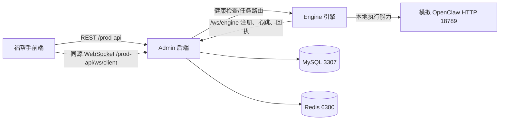

# 福帮手全功能联测与 Bug 修复清单

> **最新更新日期：2026-07-10**
> 本文以当前源码、当前本地运行实例和当前数据库状态为准；真实 OpenClaw 实机联测按要求不在本轮范围内。

## 1. 联测目标与边界

本轮覆盖 Admin 后端、Engine 引擎侧、Vue 前端、数据库迁移、模拟 OpenClaw 服务和浏览器操作闭环。测试以不破坏业务数据为原则，仅执行登录、查询、健康检查、WebSocket 连接、表单打开/必填校验/取消等操作；没有点击发布、删除、撤销、领取或真实外部平台登录按钮。

Engine 是执行侧而不是独立业务入口，闭环关系如下：



- 前端负责页面、权限路由和用户操作；业务数据由 Admin REST 接口提供。
- Engine 通过后端 WebSocket 注册、维持心跳并返回执行结果；前端不直接访问 Engine 的内部端口。
- 主机白名单、连接记录和健康检查是 Admin 对 Engine 的治理面；本轮 Engine `engine-001` 实测为已注册、在线，健康检查返回 HTTP 源类型和资源指标。
- 模拟 OpenClaw 只用于验证白名单健康检查和受控回路，不代表真实 OpenClaw 兼容性或生产授权状态。
- FBS 场景包、授权码、企业权益、API Key 和积分概览共享 Admin 权限与数据库；数据库迁移缺失会直接表现为页面 SQL 失败或菜单树缺失。

## 2. 当前环境与测试证据

| 层级 | 实例/证据 | 结果 |
|---|---|---|
| Admin | `127.0.0.1:18080` | 运行正常 |
| Engine | `engine-001`，版本 `1.3.1` | 已注册、在线；健康检查成功 |
| 前端 | `127.0.0.1:18082`，生产构建预览 | 页面、`/prod-api`、`/stage-api` 代理正常 |
| 数据库 | MySQL `3307`、Redis `6380` | FBS 迁移已应用；积分概览与明细接口成功 |
| 模拟外部依赖 | HTTP `18789` | 仅模拟 OpenClaw，未进行真实 OpenClaw 实机测试 |

自动化与浏览器证据：

- Maven 全仓测试：361 个业务测试通过；Engine 单独测试 3 个通过，Java 合计 364 个通过。
- 前端 `build:prod` 和 `build:stage` 均通过。Element Plus、ECharts 各约 1 MB 的 chunk 仍是性能提示，不阻断功能验收。
- 本地联测脚本 13/13 通过：登录、生产/预发布代理登录、同源 WebSocket `CONNECTED`、动态路由、积分数据库接口、匿名访问控制、Engine 注册/白名单/健康检查及模拟 OpenClaw 状态。
- 动态路由共 52 个叶子页面；FBS 管理侧 6 个页面和用户自助侧 4 个页面均可打开。核心页面逐页检查了标题、表格/空态、按钮和告警；仅保留两个明确的外部依赖未配置提示（主机 ID、元器平台），没有发现白屏或未捕获异常。
- 浏览器操作覆盖主机白名单模拟健康检查、Engine 健康检查、WebSocket 调试连接、FBS 场景包/企业/API Key 表单打开、必填校验和取消；未执行有副作用的提交。

## 3. Bug 清单与修复结果

| 编号 | 级别 | 现象/根因 | 修复与验证 |
|---|---|---|---|
| BUG-UI-001 | P1 | 生产/预发布 `vite preview` 未代理 `/prod-api`、`/stage-api`，构建后首页白屏并提示接口 404。 | `vite.config.js` 增加可配置 `VITE_APP_PROXY_TARGET`、预览 API 代理和 WebSocket 升级支持；生产/预发布代理登录与浏览器刷新均通过。 |
| BUG-DB-001 | P1 | 本地数据库未应用 April FBS 迁移，积分查询缺 `wx_points_record.scene_pack_id`，FBS 表和菜单也不存在。 | 按源码迁移顺序应用 20260408—20260420 脚本；应用前已做备份；10 张表、3 个积分字段、FBS 菜单恢复，积分概览/明细接口和页面复测通过。 |
| BUG-DB-002 | P1 | `FBS运营管理` 错挂到基线中的按钮 `menu_id=1000`，动态路由树无法显示。 | 修正 20260409 源 SQL 的父节点为根菜单，并新增幂等修复迁移 `sql/update_20260710_修复FBS运营菜单父节点.sql`；数据库核验 `parent_id=0, menu_type=M`，6 个管理页面可见。 |
| BUG-UI-002 | P1 | WebSocket 工具在相对 API 前缀环境硬编码 `localhost:8080`，本地和反向代理部署会连接错误端口。 | `src/utils/websocket.js` 改为显式地址优先，否则使用当前页面同源地址加 `/prod-api` 或 `/stage-api`；浏览器显示当前站点地址并收到 `CONNECTED`，脚本也通过代理握手。 |
| BUG-UI-003 | P2 | 设置页关闭 loading 立即执行，重置/尺寸选择使用字符串回调，导致延时行为不可靠并依赖动态执行。 | 改为函数回调 `setTimeout(() => ...)`；前端构建通过，相关页面可用。 |
| BUG-UI-004 | P3 | 登录首页版权文案仍为 2025。 | 更新为 `Copyright © 2026 福帮手. All Rights Reserved.`；生产构建后的登录页浏览器实测已显示新文案。 |

曾观察到的 `在线主机` 短暂空态经等待后出现 `engine-001`，属于异步加载快照时序，不登记为 Bug；直接 API 与浏览器最终状态一致。

## 4. 数据库变更与回滚边界

源码中的 `sql/update_*.sql` 是数据库真相。首次升级前先备份，再按日期顺序执行，最后执行 20260710 父节点修复迁移并核验菜单树、积分字段和 FBS 表。修复迁移只更新错误父节点，满足幂等条件；如需回滚，仅按已审批的数据库备份恢复，不在生产环境直接删除 FBS 业务表。

## 5. 未阻断项与后续观察

- Element Plus 与 ECharts chunk 仍超过 1 MB，属于 P2 性能优化项；当前已通过手工分块并不影响功能验收。
- `/content/login-manager` 的“未配置主机 ID”和 `/host/apps` 的“未登录元器平台”是当前环境依赖提示；本轮不通过伪造真实第三方登录来掩盖它们。
- 真实 OpenClaw 实机、真实元器平台、真实生产域名 Nginx 仍需在对应授权和环境具备后单独验收，本报告不把模拟结果升级为生产结论。

## 6. 可复现入口

```powershell
powershell.exe -NoProfile -ExecutionPolicy Bypass -File .\scripts\local-joint-smoke.ps1
powershell.exe -NoProfile -ExecutionPolicy Bypass -File .\scripts\doc-consistency-audit.ps1
```

以上脚本不会输出认证 token；浏览器调试地址中的 token 仅存在于当前会话内，不应复制到日志、截图或文档。
